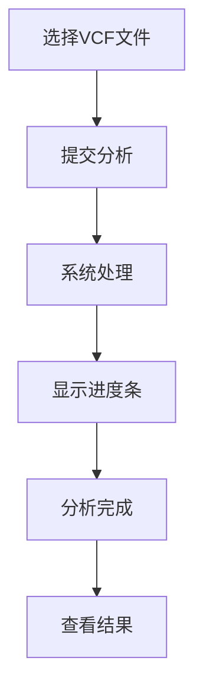

# 基因变异分析平台用户手册

## 1. 平台概述
基因变异分析平台是一个集成了机器学习与生物信息学技术的致病性预测系统，主要功能包括：
- 临床注释（整合ClinVar数据库）
- 机器学习预测变异致病性
- 蛋白质结构预测与功能分析
- 多基因风险评分（PRS）计算
- 乳腺癌风险评估与报告生成

## 2. 快速开始

### 2.1 访问平台
1. 打开浏览器访问平台网址
2. 系统将显示首页
3. 点击"开始使用"按钮进入分析页面


### 2.2 数据上传方式
平台支持两种数据输入方式：
- **VCF文件上传**：标准变异调用格式文件
- **RSID查询**：直接输入变异标识符

## 3. 详细使用指南

### 3.1 VCF文件上传分析
1. 在Upload页面，点击"上传VCF文件"区域

   

2. 选择本地VCF文件（支持GRCh38格式）

3. 点击"提交分析"按钮

4. 系统将显示上传进度



**注意事项**：
- 文件大小限制：最大10MB
- 处理时间：5000条记录约需3分钟
- 支持格式：标准VCF v4.0及以上版本

### 3.2 RSID查询
1. 在"RSID查询"区域输入变异标识符

   

2. 格式要求：以`rs`开头后接数字（如`rs123456`）

3. 不支持批量查询

4. 点击"查询"按钮开始分析

**示例输入**：
```
rs80357906
```

### 3.3 结果解读
分析完成后，系统将跳转到Results页面展示完整分析结果：

#### 3.3.1 风险概览
- **乳腺癌PRS评分**：多基因风险评分结果
- **神经网络预测风险**：AI模型预测的乳腺癌风险值
- **风险等级**：通过颜色标识风险程度
  - 绿色：低风险
  - 黄色：中等风险
  - 红色：高风险


#### 3.3.2 变异数据表格
- 可排序表格展示所有检测到的变异
- 关键列说明：
  | 列名           | 说明                   |
  | -------------- | ---------------------- |
  | 变异ID         | RSID标识符             |
  | 染色体         | 变异所在染色体         |
  | 位置           | 基因组坐标（GRCh38）   |
  | 模型预测标签   | 致病性预测结果         |
  | 临床意义       | ClinVar数据库分类      |
  | RegulomeDB分数 | 非编码变异调控潜力评分 |

**排序功能**：
- 点击表头可按照该列排序
- 再次点击切换升序/降序
- 特别推荐按"临床意义"排序快速定位高风险变异

#### 3.3.3 蛋白质变异分析
对于影响蛋白质的变异，平台提供：
- 野生型与突变型序列比对
- 氨基酸变化位置标记
- 蛋白质特征变化分析：
  - 分子量变化
  - 芳香性变化
  - 疏水性变化
  - 等电点变化

#### 3.3.4 可视化图表
- ClinVar分布图：展示不同临床意义变异的比例
- 模型预测分布：显示模型预测结果的分类
- PRS分布：染色体级别的风险分布
- 染色体预测：各染色体风险变异分布

### 3.4 报告生成
1. 在结果页面底部点击"生成PDF报告"按钮

   

2. 系统将在后台生成报告（约30-60秒）

3. 生成完成后自动下载PDF文件

**报告内容**：
- 患者风险概览摘要
- 高风险变异详细列表
- 蛋白质影响分析
- 可视化图表
- 临床建议与参考文献

## 4. 注意事项

### 4.1 数据要求
- **基因组版本**：仅支持GRCh38
- **VCF格式**：需包含标准头信息
- **RSID格式**：必须为`rs`后接数字的格式

### 4.2 性能说明
- 小文件（<200个变异）：处理时间约10-30秒
- 中等文件（200-5000个变异）：1-3分钟
- 大文件（>5000个变异）：3分钟以上

### 4.3 错误处理
常见错误及解决方法：

| 错误提示               | 可能原因       | 解决方法                 |
| ---------------------- | -------------- | ------------------------ |
| "无效的文件"           | 文件格式不正确 | 检查是否为标准VCF格式    |
| "文件大小不能超过10MB" | 文件过大       | 分割文件                 |
| "RSID格式不正确"       | 输入格式错误   | 检查是否以rs开头后接数字 |
| "未找到该变异"         | RSID不存在     | 验证RSID有效性           |
| "VCF处理失败"          | 文件内容错误   | 检查VCF文件完整性        |

## 5. 常见问题解答

**Q1：如何获取测试用的VCF文件？**
> 平台提供示例VCF文件供测试使用，可联系管理员获取或使用公共数据库下载

**Q2：蛋白质分析支持哪些变异类型？**

> 目前支持错义突变、无义突变和移码突变，同义突变分析由于蛋白质未变化，省略蛋白质特征变化表格

**Q3：PRS评分的临床意义是什么？**

> PRS评分提供个体相对于人群的乳腺癌风险评估：
>
> ```python
> # 女性
> if score < 0.5:
>         risk = "低风险"
>     elif score < 1.0:
>         risk = "中等风险"
>     elif score < 1.5:
>         risk = "高风险"
>     else:
>         risk = "极高风险"
> # 男性
> if score < 0.7:
>         risk = "低风险"
>     elif score < 1.2:
>         risk = "中等风险"
>     elif score < 1.7:
>         risk = "高风险"
>     else:
>         risk = "极高风险"
> ```
>
> 

**Q4：如何解读模型预测得分？**

> 模型预测得分范围0-1，解释如下：
> ```python
> if score < 0.05: "几乎无风险"
> elif score < 0.25: "风险低"
> elif score < 0.70: "风险较低，需进一步观察"
> elif score < 1.00: "高风险"
> else: "极高风险"
> ```

## 6. 技术支持
如需进一步技术支持：
- 邮箱：eatingsun@sjtu.edu.cn

---

**更新日期**：2025年6月7日